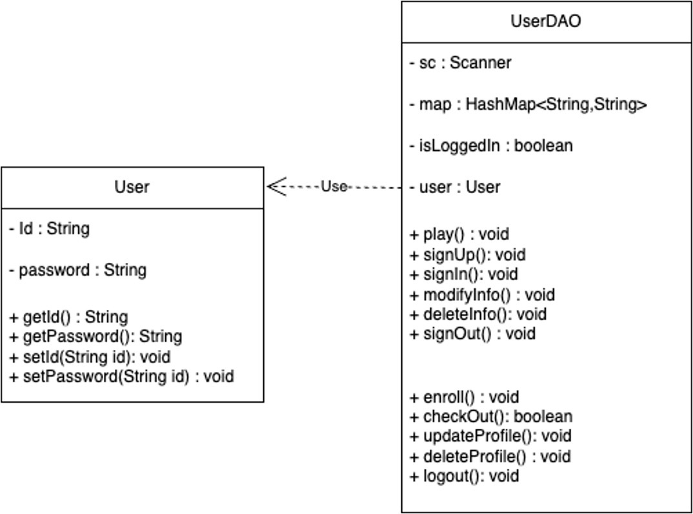
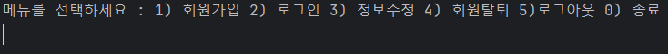
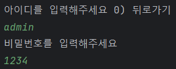
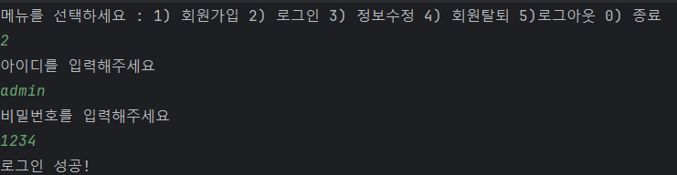
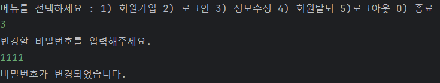
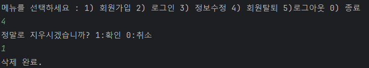
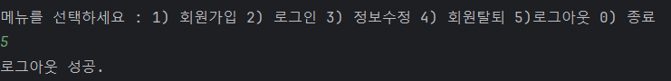
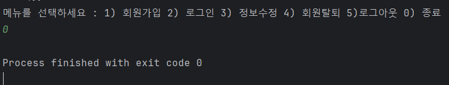

# Java-CRUD-Practice
## 자바로 CRUD 구현하기
 ### 개요: 
 1) 언어 : Java
 2) 날짜 : 2024.4.8
 3) 목표 : Java의 컬렉션 중 하나인 JDK를 활용하여 사용자로 부터 command를 입력 받아 회원가입 등 유저 관련 CRUD를 처리한다.

 ### 클래스 다이어그램
 

 ### 결과:
 1. 실행화면
 
 
 
 2. 회원가입
 
 

 3. 로그인

 

 4. 비밀번호 변경
 
 

 5. 회원 탈퇴
 
 

 6. 로그아웃

 

 7. 종료

 

